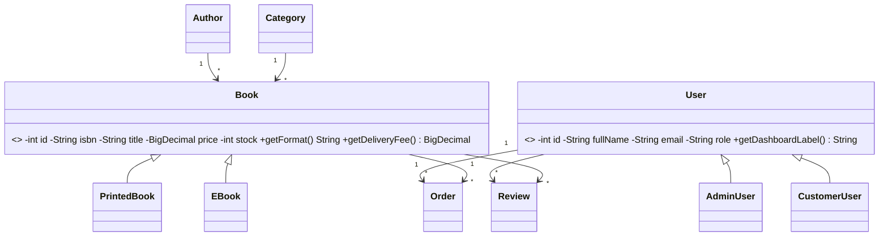

# Class Diagram

```mermaid
classDiagram
class User { <<abstract>> -int id -String fullName -String email -String role +getDashboardLabel() String }
User <|-- AdminUser
User <|-- CustomerUser
class Book { <<abstract>> -int id -String isbn -String title -BigDecimal price -int stock +getFormat() String +getDeliveryFee() BigDecimal }
Book <|-- PrintedBook
Book <|-- EBook
Author "1" --> "*" Book
Category "1" --> "*" Book
User "1" --> "*" Order
Book "1" --> "*" Order
User "1" --> "*" Review
Book "1" --> "*" Review
```
